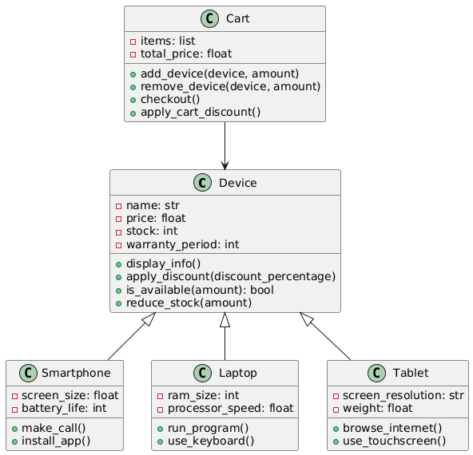

# 🛒 Electronic Device Shopping Cart

## 📌 Project Description

This project implements a fully object-oriented Electronic Device Store system in Python.

It demonstrates:

- Inheritance
- Polymorphism
- Encapsulation
- Exception Handling
- Modular Architecture
- Shopping Cart Logic
- Automatic Discount System

---

## Sample Run

1. Show Devices
2. Show Cart
3. Checkout
4. Exit

# Example:
Laptop x2 added to cart
5% discount applied!
Purchase successful!

## 🏗 Project Structure

